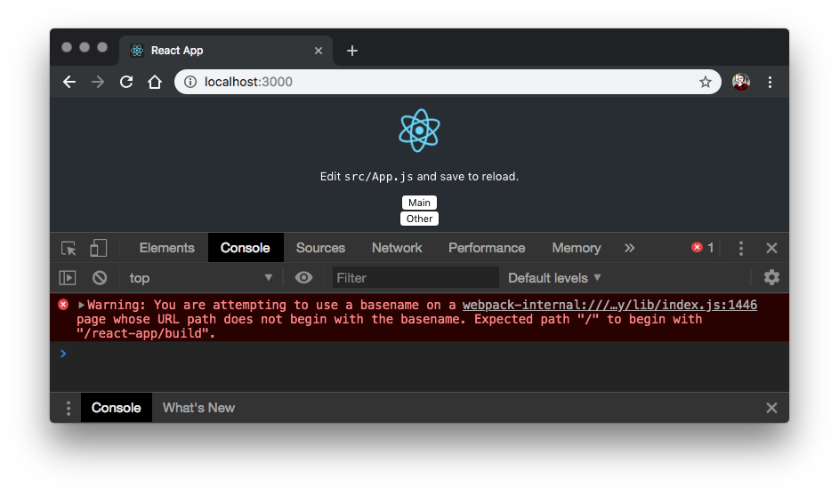
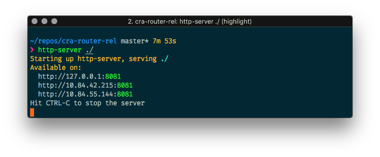
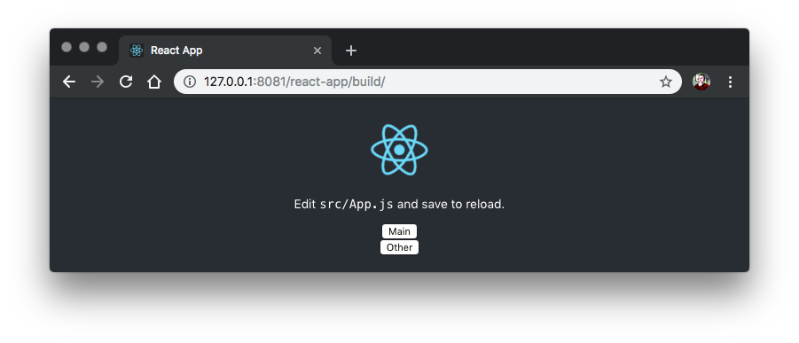
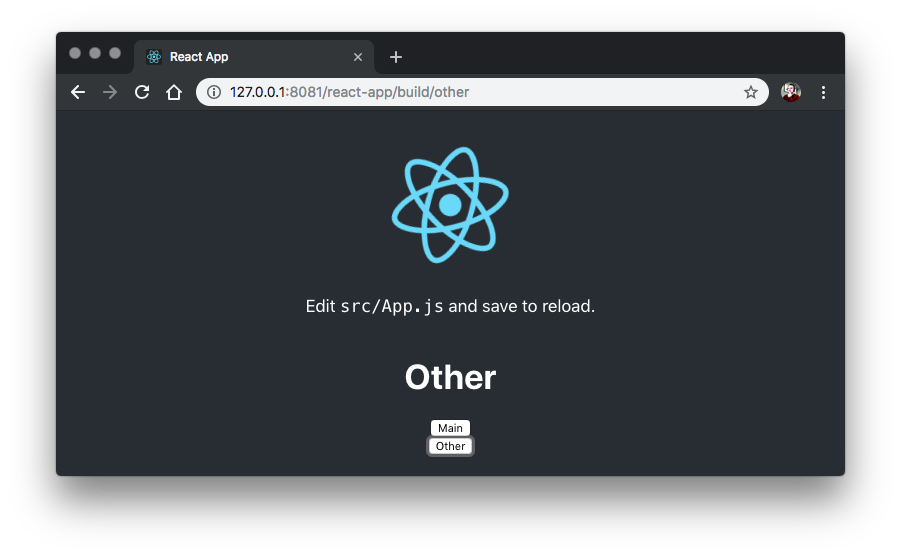
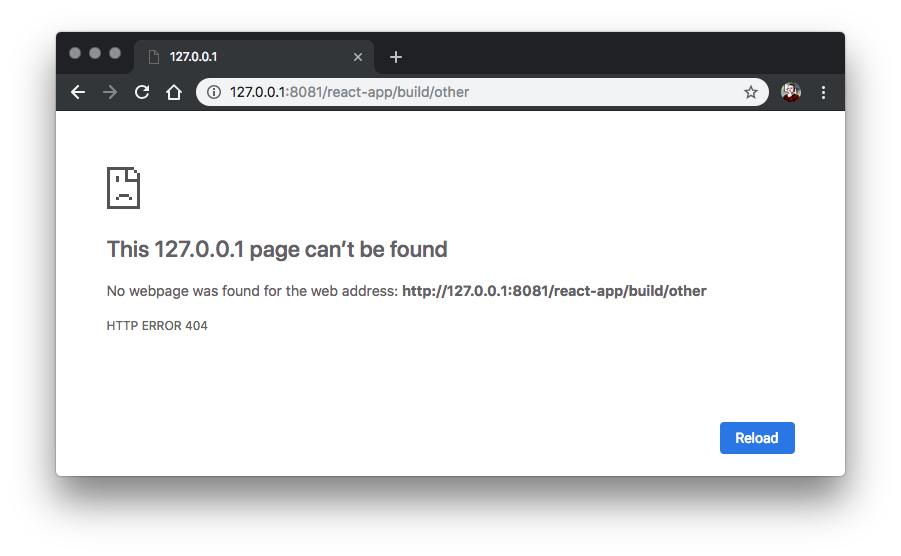

# cra-rel-serve-router

> How to serve a [Create-React-App](https://github.com/facebook/create-react-app) App from relative path with [ReactRouter](https://github.com/ReactTraining/react-router).

## Setup

```bash
# Clone this repository
git clone git@github.com:F1LT3R/cra-rel-serve-router.git

# Install Node dependencies
cd cra-rel-serve-router/react-app
yarn install

# Start the server and open the browser
yarn start
```

> Note: When using `yarn start` your browser opens to root `/`, so you will the error below, warning that your basename does not match your server path. This error is not present after running `yarn build` and running the server from the correct location.

```shell
Warning: You are attempting to use a basename on a page whose URL path does not begin with the basename. Expected path "/" to begin with "/react-app/build".
```



## Serving a Relative Path

Set the `homepage` property in `package.json` to make sure React loads resources relative to the `index.html` instead of root `/`.

### `react-app/package.json`

```json
{
  "homepage": "./"
}
```

### `react-app/src/history.js`

Create a `history.js` component and add `basename` of the relative path you will be serving your React app from.

```js
import {createBrowserHistory} from 'history';

export default createBrowserHistory({
	basename: '/react-app/build/'
});
```

### `react-app/src/App.js`

Add the `basename` of your relative serve path to your React Router.

```jsx
<Router history={history} basename="/react-app/build/">
    <div>
        <Route path="/main" component={Main} />
        <Route path="/other" component={Other} />
    </div>
</Router>
```

You can see the full code here:

```jsx
import React, { Component } from 'react';
import {Router, Route} from 'react-router-dom';
import history from './history';

import logo from './logo.svg';
import './App.css';

const Main = (props) => <h1>Main</h1>);

const Other = () => <h1>Other</h1>;

class App extends Component {
  page(route) {
    history.push(route);
  }

  render() {
    return (
      <div className="App">
        <header className="App-header">
          
          <p>
            Edit <code>src/App.js</code> and save to reload.
          </p>
          <Router history={history} basename="/react-app/build/">
            <div>
              <Route path="/main" component={Main} />
              <Route path="/other" component={Other} />
            </div>
          </Router>
          <button onClick={() => this.page('/main')}>Main</button>
          <button onClick={() => this.page('/other')}>Other</button>
        </header>
      </div>
    );
  }
}

export default App;
```

### Build and Serve The React App


```bash
# Build the React App
# (from the "react-app" directory)
yarn build

# Install and run the http-server
cd ../
npm i -g http-server
http-server ./
```



Now you can open your browser to http://127.0.0.1:8081/react-app/build/



> You can now click the `Main` and `Other` buttons to dynamically switch routes and see the words "Main" and "Other" visible in the routes. Notice the path changing in the address bar, it will keep the relative route you are serving from.

### Clicking `Main` button:


### Clicking `Other` button:



### ⚠ CAVEAT - Browser address updates

> ⚠ Important Note: If you update the address from the browser address bar, your app will break! This is true when serving from relative urls that you have built using `yarn build`, but you will not see this problem when running the local server with `yarn start`!

When updating the browser address bar to point to `127.0.0.1/react-app/build-other` you will see a `404` page not found error. This is because the server does not have an `/other` directory to serve. This means you may not be able to update the route of your app from the browser address bar unless your have configured your server to serve `index.html` for sub routes of your relative path.


